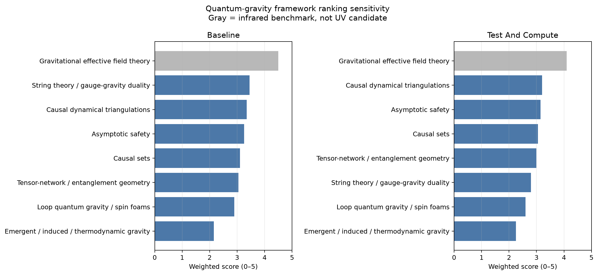

# Weighted ranking and sensitivity

Generated by `python-code/rank_frameworks.py` from the immutable inputs `data/framework_scores.csv` and `data/ranking_weights.csv`. The complete rubric and score rationale are in `scoring_rationale.md`; machine-readable output is `results/framework_rankings.csv`.

## Baseline ranking

Weights: quantum consistency 0.20; GR recovery 0.25; conservation/causality 0.15; mathematical clarity 0.15; testability 0.10; computational feasibility 0.15.

| Overall rank | Framework | Score | UV-candidate rank |
|---:|---|---:|---:|
| 1 | Gravitational EFT | 4.50 | — (infrared benchmark) |
| 2 | String theory / gauge–gravity duality | 3.45 | 1 |
| 3 | Causal dynamical triangulations | 3.35 | 2 |
| 4 | Asymptotic safety | 3.25 | 3 |
| 5 | Causal sets | 3.10 | 4 |
| 6 | Tensor-network / entanglement geometry | 3.05 | 5 |
| 7 | Loop quantum gravity / spin foams | 2.90 | 6 |
| 8 | Emergent / induced / thermodynamic gravity | 2.15 | 7 |

## Test-and-compute sensitivity ranking

Weights: quantum consistency 0.15; GR recovery 0.15; conservation/causality 0.10; mathematical clarity 0.10; testability 0.25; computational feasibility 0.25.

| Overall rank | Framework | Score | UV-candidate rank |
|---:|---|---:|---:|
| 1 | Gravitational EFT | 4.10 | — (infrared benchmark) |
| 2 | Causal dynamical triangulations | 3.20 | 1 |
| 3 | Asymptotic safety | 3.15 | 2 |
| 4 | Causal sets | 3.05 | 3 |
| 5 | Tensor-network / entanglement geometry | 3.00 | 4 |
| 6 | String theory / gauge–gravity duality | 2.80 | 5 |
| 7 | Loop quantum gravity / spin foams | 2.60 | 6 |
| 8 | Emergent / induced / thermodynamic gravity | 2.25 | 7 |

## Interpretation

1. EFT's first place is a consistency check on the rubric: the method known to recover GR and QFT below a cutoff scores strongly on those exact properties. It fails the UV-scope gate and is a benchmark, not the requested microscopic completion.
2. The UV leader is **weight-sensitive**. The baseline favors string/gauge–gravity duality by only 0.10 over CDT, while the test-and-compute scenario favors CDT. A 0.10 gap is smaller than the practical resolution of this ordinal scoring exercise.
3. The robust result is a shortlist, not a winner: string/gauge–gravity duality for quantum consistency and special-case GR/entropy recovery; CDT and asymptotic safety for direct continuum computations; causal sets and tensor networks for maximally transparent discrete toy checks.
4. No score is evidence that nature chooses a framework. The ranking prioritizes experiments inside this research program.

## Toy-model decision

The first escalation step will use three orthogonal, small checks:

- **T1 — causal-set manifoldlikeness:** Poisson sprinkling in a 1+1D causal diamond, validating ordering fraction and the Myrheim–Meyer dimension estimator. This probes causal/discrete emergence with exact finite combinatorics.
- **T2 — entanglement/geometry information test:** a small graph-state or code-inspired tensor model, checking entropy/min-cut behavior and its failure under non-isometric perturbations. This probes whether a geometric reading survives controlled violations.
- **T3 — infrared matching benchmark:** a symbolic weak-field GR/EFT calculation, checking dimensions, conservation structure, and Newtonian recovery. This is not a UV candidate; it defines what T1/T2 or a later hybrid must match.

CDT and asymptotic-safety simulations are deferred one escalation level: their simplest faithful implementations require choices of triangulation measure or beta-function truncation that would obscure the first transparent checks. This is a sequencing decision, not a judgment that they are less promising.
