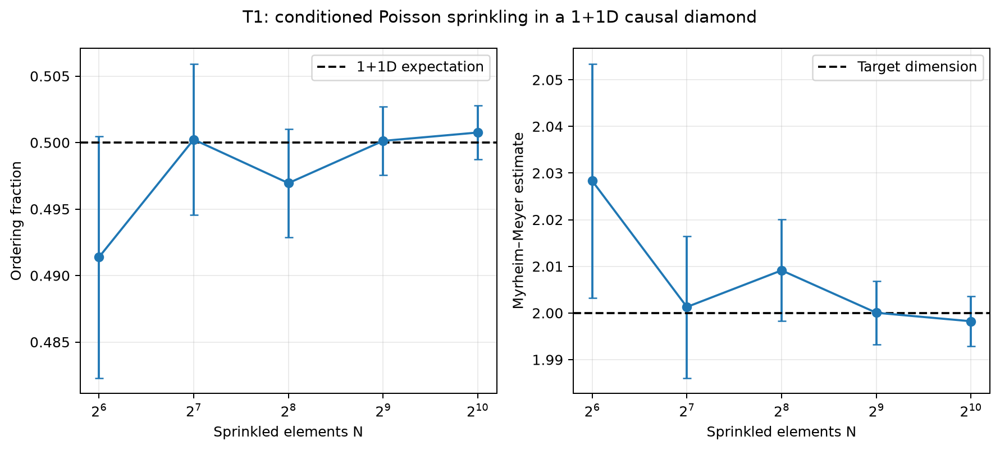
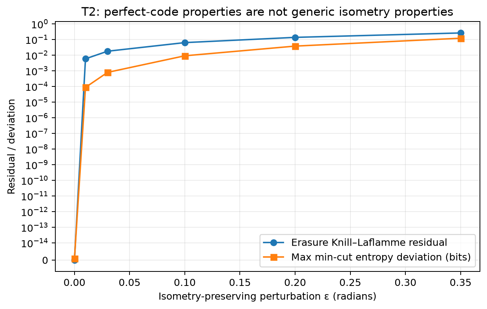
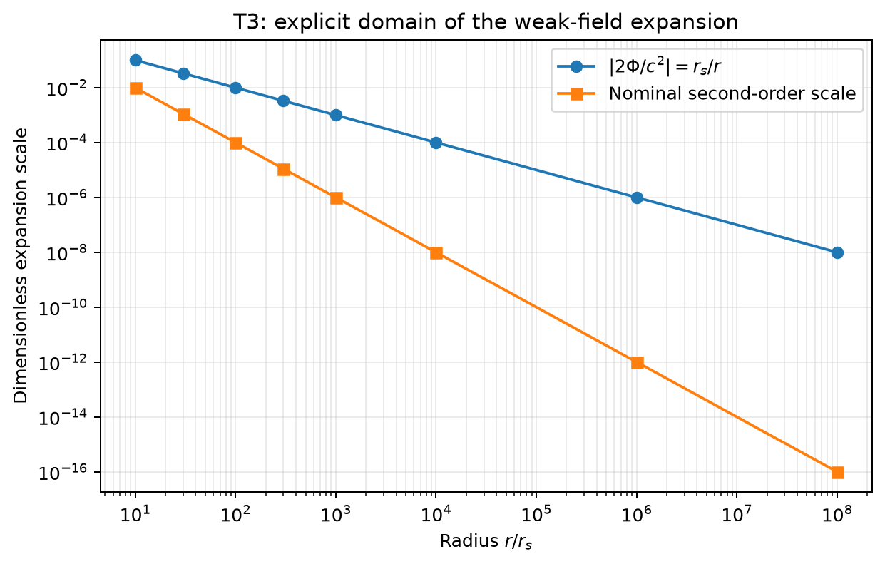
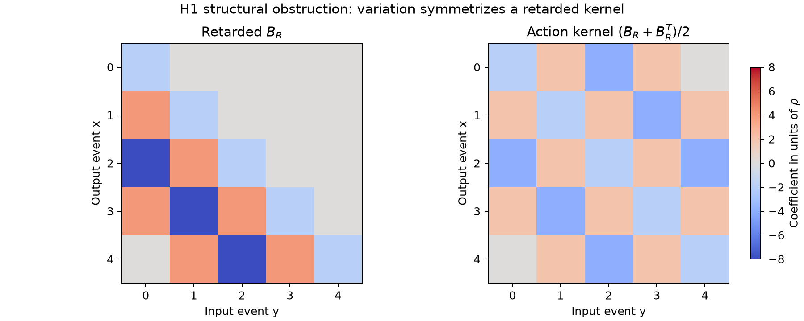

# Quantum-gravity bridge research program

## Contents

1. [Question and result](#1-question-and-result)
2. [Method and guardrails](#2-method-and-guardrails)
3. [Reproducible environment](#3-reproducible-environment)
4. [Framework comparison](#4-framework-comparison)
5. [Ranking and sensitivity](#5-ranking-and-sensitivity)
6. [T1: causal-set kinematics](#6-t1-causal-set-kinematics)
7. [T2: perfect-tensor encoding](#7-t2-perfect-tensor-encoding)
8. [T3: weak-field recovery](#8-t3-weak-field-recovery)
9. [H1: hybrid proposal and rejection](#9-h1-hybrid-proposal-and-rejection)
10. [Integrated physics audit](#10-integrated-physics-audit)
11. [Epistemic ledger and limitations](#11-epistemic-ledger-and-limitations)
12. [Conclusion and next calculation](#12-conclusion-and-next-calculation)
13. [Appendix A: glossary](#appendix-a-glossary)
14. [Appendix B: reproduction map](#appendix-b-reproduction-map)

## 1. Question and result

The program asked whether a concrete, calculable route can connect quantum microscopic degrees of freedom to classical spacetime and ordinary matter while respecting causality, conservation, unitarity, and known low-energy gravity.

No complete bridge was found. This is not a null deliverable: the project produced a source-grounded framework comparison, a transparent sensitivity-aware ranking, three reproducible toy calculations, and a hybrid proposal rejected by an exact algebraic test.

The main result is:

> A causal discrete substrate, an information-theoretic encoding of geometry, and a correct weak-field target are individually compatible ingredients, but they do not determine a viable interacting dynamics. In the first explicit hybrid, a strictly retarded causal-set operator cannot also be the kernel obtained from an ordinary real single-field quadratic action. Symmetrizing it introduces advanced support.

The result sharply separates what was calculated from what remains conjectural.

## 2. Method and guardrails

The work proceeded in five gates:

1. Establish a reproducible Python and Wolfram environment.
2. Compare major research programs using a bounded primary-source set.
3. Rank them with explicit scores, weights, and a sensitivity scenario.
4. Test three tractable claims independently.
5. Construct a minimal hybrid only after its ingredients and required limits were explicit.

Every model records variables, units, assumptions, parameters, seed where relevant, executable code, tests, saved results, and an independent Wolfram cross-check. The reports apply the following distinctions:

- Established physics: general relativity and quantum field theory in their tested domains, plus cited mathematical results.
- Reproduced result: a claim checked by saved code in this repository.
- Framework-dependent result: a nontrivial result inside a candidate program that does not establish that program as nature's theory.
- Inference: synthesis supported by the comparison but not directly derived by a model.
- Speculation: a proposed future mechanism or interpretation.

The Planck scale is treated as a motivated scale, not an observed minimum length. Mathematical consistency and numerical agreement are not described as empirical confirmation.

## 3. Reproducible environment

The environment audit is saved in [00_environment_report.md](../00_environment_report.md). The calculation stack uses an isolated CPython 3.12.13 virtual environment with exact dependency pins. The main packages are NumPy 2.5.1, SciPy 1.18.0, SymPy 1.14.0, Matplotlib 3.11.1, NetworkX 3.6.1, pandas 3.0.5, and pytest 9.1.1.

A connected stateless Wolfram Language 15.0.0 kernel passed symbolic smoke tests. A local wolframscript executable was not available, so the Python calculations are the canonical batch workflow and Wolfram outputs are saved independent cross-checks.

Direct arXiv access was verified. Literature records were retrieved from arXiv and converted into a recoverable bibliography with authors, title, year, and identifiers. The research log documents that the installed arXiv skill was consulted but its server methods were not exposed in this session, so direct primary-source retrieval was used.

## 4. Framework comparison

The detailed seven-question audit appears in [framework_comparison.md](../01_framework_comparison/framework_comparison.md). This section records the synthesis.

### 4.1 Causal sets

The fundamental object is a locally finite partial order. Causal order can encode conformal structure and counting can encode volume when an order is faithfully approximated by a Lorentzian manifold. Retarded scalar operators and curvature estimators supply concrete finite calculations [Surya 2019](https://arxiv.org/abs/1903.11544), [Benincasa and Dowker 2010](https://arxiv.org/abs/1001.2725).

Strength: manifest causal and discrete kinematics without choosing a lattice frame.

Open bridge: a quantum dynamics that selects four-dimensional manifoldlike orders, incorporates backreaction, and recovers Einstein gravity.

### 4.2 Loop quantum gravity and spin foams

Holonomies, fluxes, spin networks, and labeled two-complex histories give a background-independent quantum-geometric kinematics. Area and volume operators are well defined, and spinfoam amplitudes provide a covariant route [Ashtekar and Lewandowski 2004](https://arxiv.org/abs/gr-qc/0404018), [Perez 2012](https://arxiv.org/abs/1205.2019).

Strength: explicit background-independent quantum geometry.

Open bridge: controlled dynamics, coarse graining, continuum correlators, and ordinary low-energy QFT.

### 4.3 Causal dynamical triangulations

CDT sums over causally glued Lorentzian simplicial geometries with Regge weights. Its numerical phase structure includes extended geometries and measurable effective dimensions [Ambjørn, Jurkiewicz, and Loll 2001](https://arxiv.org/abs/hep-th/0105267), [Loll 2019](https://arxiv.org/abs/1905.08669).

Strength: direct nonperturbative ensemble computation.

Open bridge: a controlled continuum critical limit with full Lorentzian GR, realistic matter, and unitarity.

### 4.4 Tensor networks and entanglement geometry

Tensor networks make entanglement structure, minimal cuts, and redundant bulk encoding exact in finite models. They connect naturally to the Ryu–Takayanagi relation and quantum error correction [Ryu and Takayanagi 2006](https://arxiv.org/abs/hep-th/0603001), [Swingle 2009](https://arxiv.org/abs/0905.1317), [Pastawski et al. 2015](https://arxiv.org/abs/1503.06237).

Strength: unusually transparent finite calculations linking encoding and spatial geometry.

Open bridge: time, local dynamics, non-AdS settings, universal matter coupling, and Einstein equations.

### 4.5 Asymptotic safety

The effective average action evolves under a functional renormalization-group equation, and a non-Gaussian ultraviolet fixed point could make metric gravity predictive at all scales [Reuter 1996](https://arxiv.org/abs/hep-th/9605030), [Reuter and Saueressig 2012](https://arxiv.org/abs/1202.2274).

Strength: a direct scale-dependent continuum program with calculable truncations.

Open bridge: fixed-point robustness beyond truncations and regulators, Lorentzian unitarity, and a realistic matter trajectory.

### 4.6 String theory and gauge–gravity duality

Closed strings contain a massless spin-2 mode, and low-energy consistency produces gravitational dynamics. Gauge–gravity duality supplies exact or highly controlled quantum-gravitational relations in special backgrounds [Maldacena 1997](https://arxiv.org/abs/hep-th/9711200). Special black-hole microstate counts reproduce the area law within their stated domain [Strominger and Vafa 1996](https://arxiv.org/abs/hep-th/9601029).

Strength: deep quantum consistency, matter-gravity unification mechanisms, and controlled special cases.

Open bridge: realistic vacuum selection, cosmology, background-general nonperturbative definition, and direct discrimination.

### 4.7 Emergent, induced, and thermodynamic gravity

This is a heterogeneous family. Einstein-like dynamics may appear as an induced term or thermodynamic equation of state [Jacobson 1995](https://arxiv.org/abs/gr-qc/9504004), [Visser 2002](https://arxiv.org/abs/gr-qc/0204062). The microscopic degrees of freedom and universal coupling are often not derived. Broad locality and universal-energy-coupling assumptions also generate a sharp nonlocality constraint [Marolf 2014](https://arxiv.org/abs/1409.2509).

Strength: illuminating relations among gravity, entropy, and quantum fields.

Open bridge: a defined unitary microtheory, universal conserved coupling, and falsifiable deviations.

### 4.8 Gravitational effective field theory

Below a cutoff, diffeomorphism symmetry organizes a metric-and-matter derivative expansion. Long-distance quantum corrections can be separated from unknown short-distance coefficients [Donoghue 1994](https://arxiv.org/abs/gr-qc/9405057), [Burgess 2003](https://arxiv.org/abs/gr-qc/0311082).

Strength: the most controlled low-energy quantum treatment and the correct matching target.

Scope limit: it deliberately does not identify ultraviolet microscopic degrees of freedom.

## 5. Ranking and sensitivity

The ranking uses six criteria on a one-to-five ordinal scale: quantum consistency, recovery of general relativity, conservation and causality, mathematical clarity, testability, and computational tractability. Inputs are stored in [framework_scores.csv](../../data/framework_scores.csv) and [ranking_weights.csv](../../data/ranking_weights.csv); the calculation is in [rank_frameworks.py](../../python-code/rank_frameworks.py).

Baseline weights are 0.20, 0.25, 0.15, 0.15, 0.10, and 0.15 respectively. The alternative test-and-compute scenario places half the total weight on testability and tractability.

| Scope | Baseline order | Test-and-compute order |
|---|---|---|
| Infrared benchmark | EFT: 4.50 | EFT: 4.10 |
| UV candidate 1 | String/holography: 3.45 | CDT: 3.20 |
| UV candidate 2 | CDT: 3.35 | Asymptotic safety: 3.15 |
| UV candidate 3 | Asymptotic safety: 3.25 | Causal sets: 3.05 |

The UV leader changes under a defensible alternative weighting. The robust output is therefore a shortlist with complementary strengths, not a winner. EFT's high score is explicitly blocked from being called a UV completion.

## 6. T1: causal-set kinematics

### 6.1 Definition

In null coordinates \(u=t-x\), \(v=t+x\), points were sampled uniformly inside a finite causal diamond. For each fixed sample size \(N\), the causal relation is

\[
i\prec j \quad\Longleftrightarrow\quad u_i<u_j\ \text{and}\ v_i<v_j.
\]

Uniform fixed-\(N\) sampling is the Poisson process conditioned on its count. Five sizes from 64 to 1,024 were simulated with 100 repetitions each and deterministic seed 20260802.

### 6.2 Checks and result

The causal matrix passed irreflexivity and transitivity checks. A finite boost rescales null coordinates by positive reciprocal factors and leaves every order comparison exactly unchanged. The ordering fraction approaches the analytic two-dimensional value \(1/2\), and inversion of the Myrheim–Meyer relation approaches dimension two.

At \(N=1024\):

- mean ordering fraction: 0.500756;
- mean inferred dimension: 1.998224.

The narrow claim passes: a Poisson-sprinkled order reproduces this manifoldlike two-dimensional kinematic statistic. It does not test quantum dynamics, backreaction, conservation, or a four-dimensional Einstein limit.

## 7. T2: perfect-tensor encoding

### 7.1 Definition

The five-qubit \([[5,1,3]]\) stabilizer code was constructed in exact algebra and its logical input was purified into a six-qubit state. The resulting six-leg tensor is perfect: every bipartition with no more than three legs on the input side defines an isometry up to normalization.

This is the smallest transparent setting in which the entanglement/min-cut and erasure-recovery ideas can be tested exhaustively. The construction is connected to holographic quantum error-correcting codes by [Pastawski et al. 2015](https://arxiv.org/abs/1503.06237) and to the original five-qubit code by [Laflamme et al. 1996](https://arxiv.org/abs/quant-ph/9602019).

### 7.2 Checks and perturbation

Every relevant reduced density matrix, entropy, and known erasure of up to two boundary qubits was checked. Exact Wolfram algebra independently verified the stabilizer commutation relations and projector ranks.

A deterministic unitary deformation was then applied. It preserves the tensor's global isometry exactly but is not constrained to preserve all local perfectness relations.

At perturbation \(\epsilon=0.20\):

- isometry residual: zero to numerical precision;
- erasure residual: 0.136732;
- maximum entropy deviation from the min-cut value: 0.037794 bits.

The negative result is more important than the baseline identity: global isometry alone does not protect the local error-correction and geometric dictionary. A dynamical selection or stability principle is required.

## 8. T3: weak-field recovery

### 8.1 Derivation

Use signature \((-+++)\), write \(g_{\mu\nu}=\eta_{\mu\nu}+h_{\mu\nu}\), and retain linear order. For static nonrelativistic matter, \(T_{00}\simeq\rho c^2\) and \(g_{00}\simeq-(1+2\Phi/c^2)\). The \(00\) Einstein equation then yields

\[
\nabla^2\Phi=4\pi G\rho.
\]

For a point mass,

\[
\Phi(r)=-\frac{GM}{r},\qquad
\mathbf a=-\nabla\Phi=-\frac{GM}{r^2}\hat{\mathbf r},
\]

and the flux magnitude through a sphere is \(4\pi GM\). SymPy and Wolfram independently reproduce these statements.

The generic Fourier-space linearized Einstein tensor also satisfies \(k^\mu G^{(1)}_{\mu\nu}=0\), checking the linearized Bianchi identity without choosing a special wave vector or polarization.

### 8.2 Domain

The expansion parameter is

\[
\varepsilon_{\rm weak}=\frac{r_s}{r},\qquad r_s=\frac{2GM}{c^2}.
\]

The saved sweep spans \(10\le r/r_s\le10^8\) and records both first- and second-order estimates. The approximation is controlled only for \(r\gg r_s\).

T3 is an infrared acceptance test. It contains no microscopic degrees of freedom and is not evidence for an ultraviolet completion.

## 9. H1: hybrid proposal and rejection

### 9.1 Proposal

H1 combines a finite causal set \(C\), a Benincasa–Dowker-type geometric term, and a real scalar field \(\phi_x\) at each event. Its new postulate is a joint path sum so that integrating out matter changes the relative amplitudes of causal sets:

\[
Z_{H1}=\sum_C\mu(C)\int d^N\phi\,
\exp\left[\frac{i}{\hbar}
\left(S_{BD}[C]+\frac{v_*}{2}\phi^T(K_C+m^2I)\phi\right)\right],
\qquad
K_C=\frac{B_R+B_R^T}{2}.
\]

Here \(v_*=\ell_*^d\), \(\rho=\ell_*^{-d}\), and \(B_R\) is a retarded causal-set d'Alembertian with dimensions \(L^{-2}\). The two-dimensional layer coefficients used in the finite audit follow the generalized operator literature [Dowker and Glaser 2013](https://arxiv.org/abs/1305.2588).

The demanded but unproved continuum condition is

\[
\langle\delta S/\delta C\rangle
\longrightarrow
G_{\mu\nu}+\Lambda g_{\mu\nu}-8\pi G T_{\mu\nu}=0,
\]

together with causal unitary QFT for matter on manifoldlike histories.

### 9.2 Exact obstruction

On a three-element chain and in units \(\rho=1\),

\[
B_R=
\begin{pmatrix}
-2&0&0\\
4&-2&0\\
-8&4&-2
\end{pmatrix}.
\]

The operator is retarded and nonsymmetric. For any real field,

\[
\frac{\partial}{\partial\phi}
\left(\frac12\phi^TB_R\phi\right)
=\frac{B_R+B_R^T}{2}\phi.
\]

Thus an ordinary real quadratic action does not yield \(B_R\phi=0\). Its Euler–Lagrange kernel is symmetric and has nonzero entries above the diagonal, corresponding to advanced support. Keeping the nonsymmetric kernel directly as a generator does not by itself establish conservative or unitary evolution.

Python verifies the mismatch for chains of sizes three through ten and under exact order relabelings. Wolfram independently verifies the three-chain matrices and action gradient. The conclusion is algebraic, not a parameter-fit failure.

### 9.3 Decision

H1 passes engineering dimensions and order-relabeling covariance. The retarded operator passes causal support, but the action-derived kernel fails it. No discrete Ward identity, weak-field GR limit, or unitary matter construction was derived.

H1 is rejected at the first structural gate. No second hybrid was added merely to absorb unused ingredients.

## 10. Integrated physics audit

| Requirement | T1 | T2 | T3 | H1 |
|---|---|---|---|---|
| Explicit degrees of freedom | Pass | Pass | Pass | Pass |
| Dimensional consistency | Limited/pass | Dimensionless finite model | Pass | Limited/pass |
| Exact relabeling or basis covariance | Pass | Pass | Not the target | Pass |
| Causal propagation | Kinematic only | Not tested | Classical target only | Retarded operator passes; action kernel fails |
| Conservation identity | Not tested | Norm/isometry only | Linearized Bianchi passes | Not derived |
| Unitarity or norm preservation | Not tested | Finite isometry passes | Not a quantum model | Not established |
| Controlled GR/Newtonian limit | Not tested | Not tested | Pass in stated domain | Not derived |
| Matter backreaction | No | No | Classical source only | Proposed, not consistently derived |
| Black-hole area law | Not applicable | Not established | Outside domain | Not applicable |
| Parameter sensitivity | Finite-size sweep | Perturbation sweep | Domain sweep | Chain-size audit |

No column passes the full bridge checklist. Combining passed cells from different models would be an invalid proof unless a single dynamics is shown to preserve all of them simultaneously.

## 11. Epistemic ledger and limitations

### Reproduced in this workspace

- The T1 ordering fraction and dimension convergence.
- The T2 perfect-tensor identities, erasure checks, and perturbative fragility.
- The T3 Poisson, flux, dimensional, and linearized Bianchi checks.
- The H1 action-versus-retarded-kernel obstruction.
- The deterministic ranking and its sensitivity to weights.

### Supported by cited framework literature

- Causal order and counting as candidate spacetime data.
- Discrete causal-set d'Alembertian and curvature constructions.
- Background-independent loop/spinfoam kinematics.
- CDT phase and continuum-limit program.
- Holographic entropy and code-inspired reconstruction.
- Functional-renormalization fixed-point program.
- String low-energy gravity and special dualities or microstate counts.
- Gravitational EFT as a controlled low-energy expansion.

These are programmatic or domain-limited results, not empirical confirmation of a final quantum-gravity theory.

### Inferences

- The leading candidates are complementary enough that modular validation is more informative than a winner-take-all ranking.
- A microscopic dynamics must protect or explain the entanglement structures used as geometry; bare isometry is insufficient.
- Causal response and a conventional real single-field action cannot simply be assumed to use the same nonsymmetric finite kernel.

### Speculation and open work

- A doubled Schwinger–Keldysh or influence-functional formulation may encode retarded response consistently.
- An ensemble-level Ward identity may provide a bridge from order variation to conserved stress response.
- Tensor-network encoding might be useful inside a causal dynamics if its stability principle is derived.

None of these future mechanisms is established by the present calculations.

Principal limitations include low dimension and finite size in T1, a six-qubit code rather than a continuum tensor network in T2, a classical infrared regime in T3, and chain causal sets rather than manifoldlike interacting ensembles in H1. The ranking uses ordinal expert judgments and two weight sets, not statistical posterior probabilities. No new empirical observable or experimental bound was derived.

## 12. Conclusion and next calculation

The project finds no complete microscopic-to-classical theory. It does establish a stricter research funnel:

1. Preserve the exact low-energy EFT, Bianchi, and Newtonian checks.
2. Demand a defined microscopic Hilbert space or path-integral measure.
3. Derive causal matter response and backreaction from one consistent formalism.
4. Prove a conservation or Ward identity before fitting phenomenology.
5. Test continuum and finite-size convergence.
6. Only then ask whether distinctive observational corrections survive.

The next justified calculation is a finite doubled-field causal-set model in which the retarded response arises from a closed-time-path construction. Its acceptance conditions should be fixed in advance: normalized evolution, causal retarded response, a positive or otherwise controlled state functional, a discrete conservation identity, stability under causal-set size and sprinkling, and convergence toward the T3 infrared equations. Failure at any one of those gates should be preserved as a result.

## Appendix A: glossary

- Asymptotic safety: the proposal that gravitational renormalization-group flow approaches a predictive non-Gaussian ultraviolet fixed point.
- Backreaction: the response of geometry to matter or quantum stress, rather than propagation on a fixed background.
- Causal set: a locally finite partially ordered set interpreted as discrete causal spacetime data.
- Continuum limit: a controlled regime where discrete or regulated observables approach continuum physics independent of regulator details.
- Effective field theory: an expansion in operators suppressed by a cutoff, valid at energies below that cutoff.
- Faithful embedding: a map from a causal set into a Lorentzian manifold that respects causal relations and approximately matches volume by counting.
- Perfect tensor: a tensor that acts as an isometry for every bipartition with at most half its indices on the input side.
- Retarded operator: an operator whose value at an event depends only on that event and its causal past.
- Spin foam: a labeled two-complex representing a history of spin-network quantum geometry.
- Ward identity: a relation expressing a symmetry and its associated conservation law at the quantum or discretized level.

## Appendix B: reproduction map

Run commands from the repository root:

1. Install the pinned environment:

       python-code/.venv/bin/python -m pip install -r python-code/requirements-lock.txt

2. Verify the environment:

       python-code/.venv/bin/python python-code/verify_environment.py

3. Reproduce the ranking and models:

       python-code/.venv/bin/python python-code/rank_frameworks.py
       python-code/.venv/bin/python python-code/toy_models/t1_causal_set.py
       python-code/.venv/bin/python python-code/toy_models/t2_perfect_tensor.py
       python-code/.venv/bin/python python-code/toy_models/t3_weak_field.py
       python-code/.venv/bin/python python-code/toy_models/h1_causal_scalar_audit.py

4. Run all Python checks:

       python-code/.venv/bin/python -m pytest -q -c python-code/pytest.ini

The Wolfram source files in [wolfram-notebooks](../../wolfram-notebooks/) contain independent symbolic checks; their saved outputs are in the corresponding results directories. Exact parameters and provenance are stored beside each result set, while the append-only [research log](../research_log.md) records decisions and negative results.

The complete bibliography is [references.bib](../references/references.bib). It is the citation registry for the comparison and models. The final machine-readable verification record is [reproducibility_audit.json](../../results/reproducibility_audit.json).
